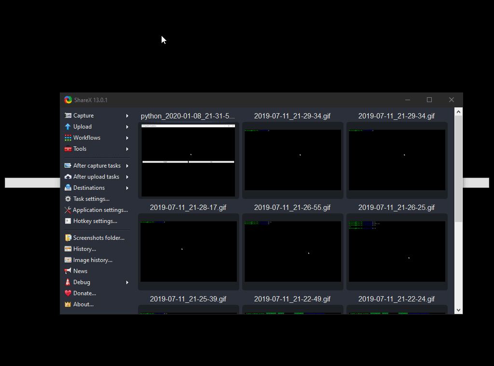

# Visualizers

Algorithm Visualizer written with pyqt and pyqtgraph.

# How to use?

Simply pull down the repository and install required dependencies specified within the `requirements.txt`

Then, run `python Display.py`

# Demo

